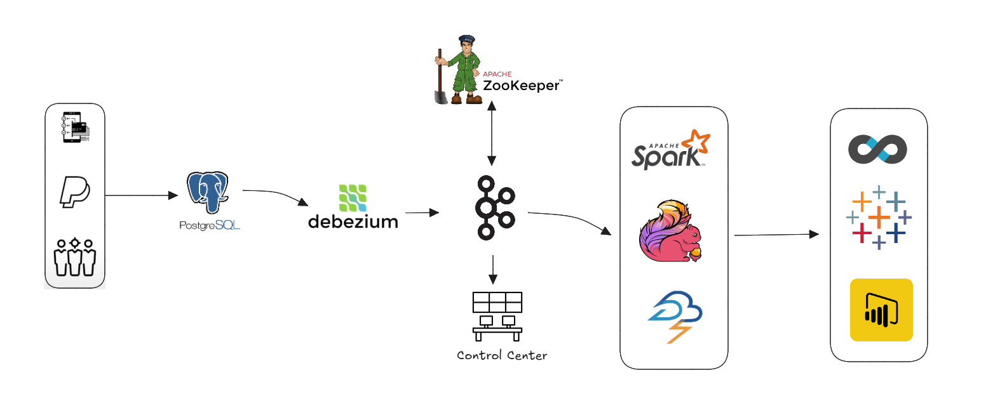
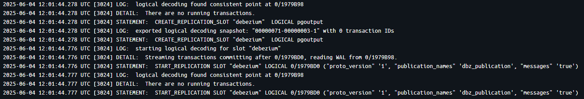
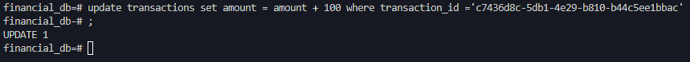
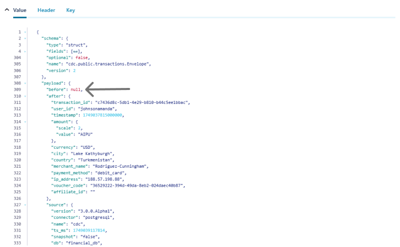
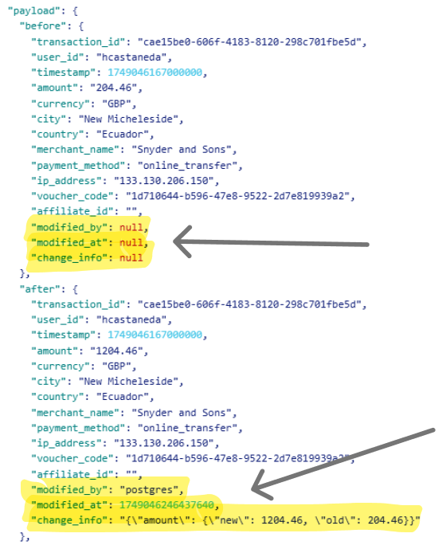

# ChangeCapture End-to-End Demo

A complete end-to-end demonstration of **Change Data Capture (CDC)** using Debezium,  PostgreSQL,  Kafka,  and Docker. This project sets up a simulated transaction generator to showcase real-time data streaming and CDC in action.

---
## System Architecture

---
## What’s Inside?

This repository provides a fully containerized and ready-to-run architecture that includes:

| Component             | Description |
|----------------------|-------------|
| **PostgreSQL**       | Source database where synthetic financial transactions are inserted. |
| **Debezium**         | Captures row-level changes in PostgreSQL and streams them to Kafka. |
| **Apache Kafka**     | Distributed event streaming platform. |
| **ZooKeeper**        | Coordination service for Kafka brokers. |
| **Kafka Control Center** | UI for managing and monitoring Kafka topics and connectors. |
| **Debezium UI**      | Web interface for configuring and managing Debezium connectors. |
| **Python Transaction Generator** | Uses faker  to simulate financial transactions into PostgreSQL. |

---

## Use Case: Real-Time Financial Transactions

This project simulates a financial transaction system where fictitious transactions are generated and stored in PostgreSQL. These changes are then captured via Debezium and streamed through Kafka, enabling real-time analytics or integration with downstream systems.

---

## Prerequisites

Before running this project, ensure you have the following installed:

- Docker
- Docker Compose
- Python 3.9+
- Python dependencies:
  - psycopg2-binary
  - faker
  
---
*1. Replication from postgres to debezium*

*2. Updating in database*

*3. Before and After, after updating in DB before Change Data Capture*

*3. Before and After, after updating in DB after Change Data Capture*

